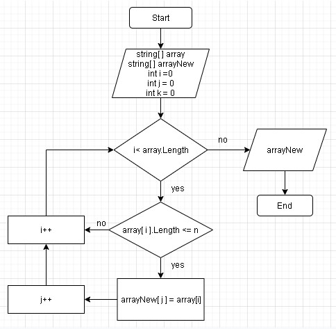

# Итоговая проверочная работа.
## Задача: 
*Написать программу, которая из имеющегося массива строк формирует новый массив из строк, длина которых меньше, либо равна 3 символам. Первоначальный массив можно ввести с клавиатуры, либо задать на старте выполнения алгоритма. При решении не рекомендуется пользоваться коллекциями, лучше обойтись исключительно массивами.*
## Алгоритм решения:
1. Просим пользователя ввести значения массива строк через пробел.
2. Делаем перебор значений из исходного массива.
3. Проверяем каждое значение из массива на соответствие условию: длина строки меньше или равна трем.
4. Если строка удовлетворяет условию, записываем значение в новый массив.
4. Повторяем пункты 3 и 4 до тех пор пока не достигнем конца исходного массива.
5. Возвращаем новый заполненый массив.
## Блок-схема:
: